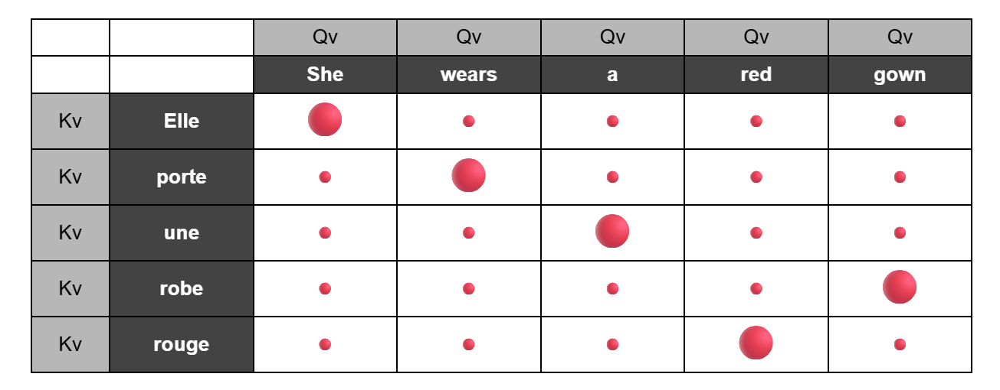

# Attention Mechanism

## Resource(s) Studied

* 3Blue1Brown – *Attention in Transformers*
* Jay Alammar – *The Illustrated Transformer*

---

# In One Sentence

Attention is the mechanism by which each token gathers information from the most relevant tokens in a sequence before updating its own contextual representation.

---

# What Is It?

A token begins life with a static embedding that captures its general meaning. However, language is inherently contextual. The meaning of a word often depends on the words surrounding it. For example, the word *bank* could refer to a financial institution, the edge of a river or even trusting someone, depending entirely on context.

The purpose of attention is to provide that context.

Instead of assigning every token a fixed meaning, attention allows each token to examine the rest of the sequence and decide which other tokens are most helpful in understanding itself.

In simple terms, every token asks:

> **"Which other tokens contain information that will help me understand what I mean in this sentence?"**

The answers to that question determine how the token updates its representation.

It is important to understand that attention does **not** create new information. Every piece of information already exists somewhere within the input sequence. Attention simply redistributes that information according to learned relevance, allowing each token to build a richer understanding of itself.

---

# Why Was It Invented?

Earlier language models struggled to retain information from long pieces of text. As sequences became longer, important context was gradually lost, making it difficult to capture relationships between words that were far apart.

Attention solved this problem by allowing every token to directly gather information from whichever parts of the sequence are most relevant, regardless of how far away those tokens appear.

This not only improved the model's ability to understand long-range relationships but also made it possible to process all tokens in parallel, greatly increasing training efficiency.

---

# What Problem Does It Solve?

Attention solves the problem of **contextual understanding**.

Rather than assigning every word a single fixed meaning, it allows each token to interpret itself using information gathered from the surrounding context.

This enables the model to understand relationships such as:

* adjectives describing nouns
* subjects performing actions
* pronouns referring to earlier entities
* long-range dependencies
* grammatical structure
* semantic relationships

Without attention, words would largely retain their generic meanings. With attention, every token develops a meaning that reflects its role within the specific sentence being processed.

---

# **"How Self-Attention Works"**

## Every Token Begins with One Embedding

A token is a chunk of text. Depending on the tokenizer, it may represent:

* an entire word
* part of a word
* punctuation
* numbers
* or other text fragments

Each token initially has a single learned embedding that captures its general meaning.

However, a single embedding is not sufficient during attention because it must play three different roles simultaneously.

The model therefore learns **three separate projections** of every embedding.

* **Query (Q):** What kind of information am I looking for?
* **Key (K):** What information can I offer to other tokens?
* **Value (V):** If another token attends to me, what information should I contribute?

Notice that these are **not** three different embeddings.

They are three different learned views of the same embedding, each designed for a different purpose during attention.

---

## How Self-Attention Is Computed

Self-attention follows the same sequence of operations for every token.

Suppose we are processing the sentence:

> **She wears a red gown.**

Imagine that we are updating the representation of the token **gown**.

### Step 1 – Create Query, Key and Value

The embedding for **gown** is projected into three vectors:

* Query
* Key
* Value

This happens for **every** token in the sentence.

The reason is simple:

A token needs one representation for asking questions (Query), another for advertising what it knows (Key), and another for sharing information (Value).

---

### Step 2 – Compare the Query with Every Key

The Query for **gown** is compared with the Key of every token in the sentence.

Conceptually, **gown** is asking:

> **"Which words contain information that will help me understand myself?"**

The comparison is performed using a **dot product**.

A higher dot product indicates that two tokens are more relevant to one another in the current context.

At this stage, the model has not gathered any information yet.

It has simply measured how relevant every token appears to be.

---

### Step 3 – Scale the Scores

Some dot products can become very large, especially when working with high-dimensional vectors.

Large values make the next step—Softmax—too confident, causing attention to become excessively concentrated on a small number of tokens.

To prevent this, every compatibility score is divided by the square root of the vector dimension.

This keeps the scores within a range that allows learning to remain stable.

---

### Step 4 – Apply Softmax

The scaled compatibility scores are passed through the Softmax function.

Softmax converts the raw scores into **attention weights**.

These weights have two useful properties:

* every weight lies between 0 and 1
* all of the weights add up to 1

They can therefore be interpreted as how much attention the current token should pay to every other token.

---

### Step 5 – Weight the Value Vectors

The attention weights are **not** applied to the Queries or the Keys.

Instead, each Value vector is multiplied by its corresponding attention weight.

This allows more relevant tokens to contribute more information, while less relevant tokens contribute proportionally less.

In other words, attention determines **how much** information each token should share.

---

### Step 6 – Create a Contextual Embedding

Finally, the weighted Value vectors are added together.

The result is a brand new **contextual embedding** for the token.

This new embedding reflects not only the original meaning of **gown**, but also the information gathered from the rest of the sentence.

Attention has therefore achieved its purpose:

It has allowed the token to reinterpret itself using context.

---

The complete process can be summarised as follows.

| Step | What Happens                         | Why?                                                            |
| ---- | ------------------------------------ | --------------------------------------------------------------- |
| 1    | Create Query, Key and Value vectors. | One embedding must play three different roles during attention. |
| 2    | Compare the Query with every Key.    | Measure how relevant every token is.                            |
| 3    | Scale the scores.                    | Prevent Softmax from becoming overly confident.                 |
| 4    | Apply Softmax.                       | Convert compatibility scores into attention weights.            |
| 5    | Weight the Value vectors.            | Allow more relevant tokens to contribute more information.      |
| 6    | Sum the weighted Value vectors.      | Produce a richer contextual embedding.                          |

One important insight emerged while studying this process:

> **Attention does not create new information. It gathers and redistributes information that already exists within the sequence according to learned relevance.**

This entire computation happens **simultaneously for every token** in the sequence, making attention highly parallelisable and one of the key reasons Transformers scale so effectively.

---

## Visualising Self-Attention

To make the process more concrete, consider the sentence:

> **She wears a red gown.**

When updating the representation of **gown**, its Query is compared with the Keys of every token in the sentence.

The resulting compatibility scores can be visualised as an attention matrix.

Each cell in the matrix represents how strongly one token attends to another. Larger dots indicate higher Query–Key dot products. After scaling and applying Softmax, these produce higher attention weights, allowing those tokens to contribute more information to the new contextual embedding.

Although the diagram focuses on a single token, the same computation is performed simultaneously for every token in the sequence.

---

## Causal Masking

Because GPT models generate text one token at a time, they must never "peek into the future" during training.

When predicting the next token, the model should only have access to the tokens that have already appeared.

To enforce this constraint, GPT uses **causal masking**.

In my attention matrix, Queries are placed on the columns and Keys on the rows. This means the lower-left portion of the matrix is masked, preventing a token from attending to any future tokens.

As a result, each prefix of a sentence becomes an independent training example.

For example, an eight-token sentence provides eight learning opportunities.

* Predict token 2 using token 1.
* Predict token 3 using tokens 1–2.
* Predict token 4 using tokens 1–3.
* Continue until the final token.

This allows a single sentence to generate multiple training examples while ensuring that future information never leaks into earlier predictions.

---

## Context Windows

Attention operates only within the model's **context window**.

If a model has a context window of 8,000 tokens, every token can conceptually compare itself with every other token within those 8,000 tokens.

This allows information introduced much earlier in the input to influence later predictions.

For example, when predicting the final sentence of a mystery novel, the model can attend to clues introduced many pages earlier—as long as those clues still lie within the context window.

This ability to relate distant pieces of information is one of the major reasons Transformers perform so well on long documents.

---

## Multi-Head Attention

The discussion so far has described a single attention head.

In practice, Transformers use **multi-head attention**.

Instead of learning just one set of Query, Key and Value projection matrices, the model learns multiple independent sets.

Each attention head therefore performs its own attention calculation in parallel.

During training, different heads naturally learn to focus on different types of relationships.

For example, one head may become particularly sensitive to grammatical relationships, another to nearby descriptive words, while another may specialise in long-range references.

The outputs of all attention heads are then combined before being passed to the next stage of the Transformer.

Using multiple attention heads allows the model to capture many different patterns simultaneously, producing richer contextual embeddings than a single attention head could learn on its own.

---

## Cross-Attention

## Cross-Attention

Everything discussed so far describes **self-attention**, where every token attends to other tokens within the **same sequence**.

**Cross-attention** uses the same attention mechanism but applies it **between two different sequences**. Instead of asking, *"Which words in my own sentence should I pay attention to?"*, the model asks, *"Which words in the other sentence are most relevant to what I'm generating?"*

For example, during machine translation:

In the diagram above, the **columns** represent the English words being generated by the decoder, while the **rows** represent the French words encoded by the encoder. Larger circles indicate stronger Query–Key matches.

Notice that each English word attends most strongly to the French word that provides the information needed to generate it. For example, **"She"** attends to **"Elle"**, **"wears"** attends to **"porte"**, **"red"** attends to **"rouge"**, and **"gown"** attends to **"robe"**. Rather than relying on word positions, the model learns which words in the two languages correspond to one another.

Unlike self-attention, where both axes represent the same sequence, cross-attention connects **two different sequences**. The **Queries** come from the decoder (the sentence being generated), while the **Keys** and **Values** come from the encoder (the source sentence). This allows the decoder to look back at the encoded source sentence as it generates the translation, one word at a time.

---
---

## Building Richer Representations

Attention is only one stage of a Transformer layer.

Each round of attention enriches every token by gathering relevant information from the rest of the sequence.

These contextual embeddings are then processed independently by a **Feed-Forward Network (FFN)** before entering the next attention layer.

The process then repeats.

With every Transformer layer, tokens accumulate increasingly sophisticated contextual information.

Early layers may capture local grammatical relationships.

Later layers can represent much more abstract concepts such as sentiment, writing style, intent, topic and relationships between ideas.

Rather than understanding a sentence all at once, the Transformer progressively refines every token's representation through many cycles of attention followed by feed-forward processing.

---

# Mental Model

Every token begins with only a rough understanding of its meaning.

Before deciding what it really means in the current sentence, it asks every other token:

> **"Do you have information that will help me understand myself?"**

Tokens that appear more relevant contribute more of their Value vectors.

Less relevant tokens contribute less.

The combined result becomes a richer contextual embedding.

In other words:

> **Attention gathers the evidence a token needs to understand itself in context.**

The next stage of the Transformer—the Feed-Forward Network—then interprets that evidence before the process repeats.

---

# Enterprise Implications

Attention enables Large Language Models to reason over relationships rather than isolated words.

Instead of analysing sentences word by word, they can understand how ideas relate across an entire document.

This capability underpins many enterprise applications, including:

* document summarisation
* question answering
* legal document review
* code generation
* knowledge retrieval
* contract analysis
* conversational AI
* enterprise search

In each case, success depends not on recognising individual words, but on understanding how information across the sequence fits together.

---

# How This Changes the Way I Use AI

I now understand that an LLM does not interpret my prompt one sentence at a time.

Every token influences how subsequent tokens are understood.

This reinforces the importance of providing sufficient context, placing important information clearly within the prompt, and recognising that prompt quality depends as much on relationships between ideas as on the individual words themselves.

---

# Common Misconceptions

* Self-attention does **not** mean a token only attends to itself. It attends to every token in the same sequence, including itself.
* Query, Key and Value vectors are **not** separate embeddings. They are learned projections of the same embedding.
* Attention does **not** create new information. It gathers and redistributes information already present in the sequence according to learned relevance.
* Attention alone does **not** create understanding. Feed-Forward Networks, residual connections and many stacked Transformer layers progressively refine the contextual embeddings.
* Cross-attention differs from self-attention because the Queries come from one sequence while the Keys and Values come from another.

---

# Questions I Still Have

* Why is the dot product such an effective measure of semantic compatibility?
* How exactly are the Query, Key and Value projection matrices learned during training?
* How do different attention heads naturally specialise?
* Why does scaling Transformer models produce such dramatic improvements in capability?
* What happens mathematically inside the Feed-Forward Network after attention has produced the contextual embeddings?

---

# Key Takeaway

Attention is not a mechanism for assigning importance to words.

It is a mechanism that allows every token to gather information from the most relevant parts of a sequence before updating its own representation.

By repeatedly gathering contextual evidence across many Transformer layers, attention enables language models to develop rich, context-sensitive representations that make modern Large Language Models dramatically more capable than earlier sequence models.

The output of attention is **not** the final understanding of a token. It is the contextual evidence that the rest of the Transformer uses to build increasingly sophisticated representations.
