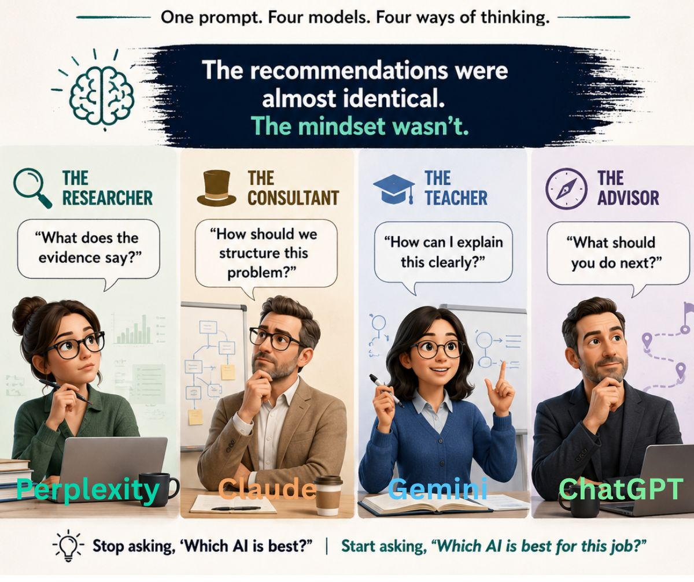

# AI Models: One Prompt, Four Ways of Thinking

## Resource(s) Studied

- Personal exploration and comparative evaluation exercise
- Comparative study of:
  - ChatGPT
  - Claude
  - Gemini
  - Perplexity
- LinkedIn reflection exercise

---

## Background

As part of my exploration of the contemporary AI ecosystem, I wanted to understand whether different AI systems approach the same business problem differently.

Rather than comparing benchmark scores or feature lists, I designed a practical exercise using a Project Management Office (PMO) scenario.

The objective was not to determine which AI model was "best", but to understand whether different models exhibit different reasoning styles, priorities, and interaction patterns.

---

## The Prompt

I asked each model the same question:

> "I am a Project Management Office leader. What are five ways AI can improve status reporting?"

The models evaluated were:

- ChatGPT
- Claude
- Gemini
- Perplexity

---

## Visual Representation

This exercise compared how four contemporary AI systems approached the same PMO problem.

---

## What I Learned

Although the recommendations produced by the models were remarkably similar, their approaches differed significantly.

Common recommendations included:

- Automated data collection
- Executive summaries
- Predictive risk identification
- Standardized reporting
- Audience-specific communication

The primary difference was not what the models recommended.

The difference was how they approached the problem.

---

## Key Concepts Encountered

- AI Ecosystem
- Enterprise AI Adoption
- AI Positioning
- AI Personas
- Prompt Engineering
- Comparative Evaluation
- Enterprise Use Cases
- Research Workflows
- AI Reasoning Styles
- Human-AI Interaction

---

## Mental Models / Analogies

This exercise led me to formulate the following mental model:

| Model | Observed Mindset |
|--------|------------------|
| Perplexity | The Researcher |
| Claude | The Consultant |
| Gemini | The Teacher |
| ChatGPT | The Advisor |

The insight that emerged was:

> The recommendations were almost identical.
>
> The mindset wasn't.

This changed the question I ask when evaluating AI systems.

Instead of asking:

> "Which AI model is best?"

I now ask:

> "Which AI model is best for this particular job?"

---

## What Surprised Me

I expected four substantially different recommendations.

Instead, I discovered that:

- The recommendations were highly similar.
- The real differences emerged in the framing, structure, explanation style, and decision-making approach of each model.

For example:

### Perplexity

- Evidence-oriented
- Citation-heavy
- Research-focused

### Claude

- Structured and analytical
- Consulting-oriented
- Governance-aware

### Gemini

- Educational
- Explanatory
- Contextual

### ChatGPT

- Action-oriented
- Practical
- Strategic and advisory

---

## Enterprise Implications

This exercise suggests that enterprise AI adoption may not be about selecting a single "best" AI model.

Instead, organizations may need to think in terms of an AI portfolio strategy, where different models serve different business purposes.

| Business Need | Suitable Model Characteristics |
|---------------|-------------------------------|
| Research and fact-finding | Search-oriented and evidence-based |
| Analysis and strategy | Structured and consultative |
| Learning and enablement | Educational and explanatory |
| Decision support and execution | Practical and action-oriented |

For transformation leaders, this means that AI platform selection should consider not only capability and cost, but also interaction style, workflow fit, governance requirements, and user experience.

---

## Questions I Still Have

- How much of a model's "personality" is determined by training data versus alignment and reinforcement learning?
- Will enterprise organizations eventually standardize on a single model, or adopt multiple specialized models?
- How should organizations evaluate AI systems beyond benchmark performance?

---

## Personal Reflection

This exercise changed how I think about AI evaluation.

I initially assumed that comparing AI models meant comparing outputs.

Instead, I discovered that the more interesting comparison may be between the mental frameworks that different models appear to apply to the same problem.

This reinforced an idea that increasingly shapes my thinking about enterprise AI adoption:

> The question is not:
>
> "Which AI model is best?"
>
> The question is:
>
> "Which AI model is best suited for this particular task?"
