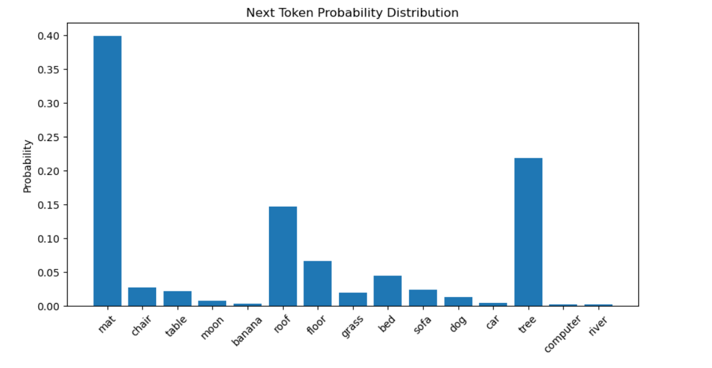
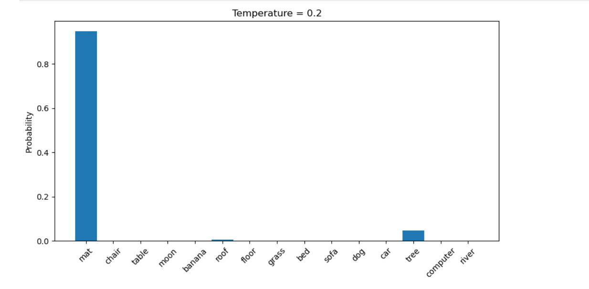
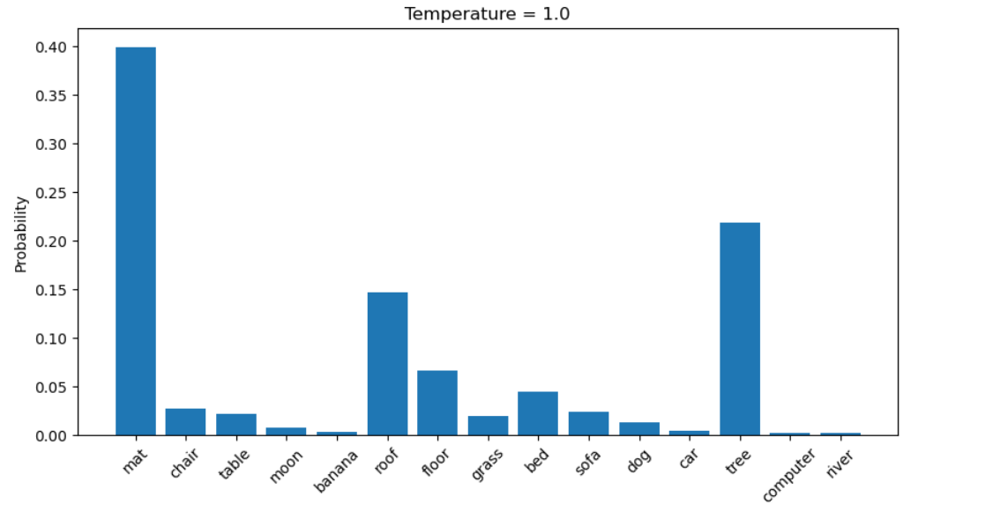
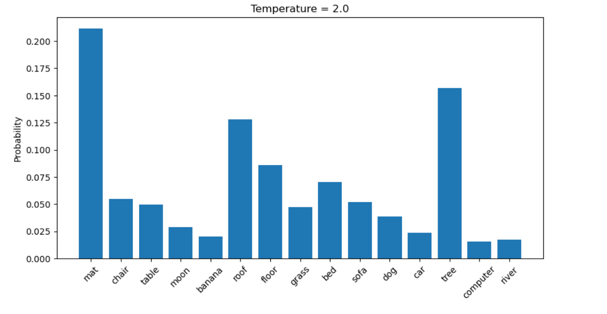

# Tiny Next Token Predictor

## Objective

The goal of this experiment was **not** to build a language model.

Instead, I wanted to understand one small but important part of LLM inference:

> **How raw model scores (logits) become a probability distribution from which the next token is selected.**

To explore this, I built a tiny educational simulation of the final stage of next-token prediction using a small vocabulary and a few lines of Python.

---

## What I Built

For this experiment, I built a miniature next-token predictor consisting of:

- A vocabulary of 15 tokens
- Manually assigned logits
- My own implementation of Softmax
- A bar chart showing the probability distribution
- Temperature-based sampling
- Random next-token selection

Unlike a real LLM, there is **no neural network** here.

The logits are manually assigned so that I could focus entirely on understanding the inference process.

---

## Step 1 – Define a Tiny Vocabulary

Instead of using the 100,000+ token vocabulary found in modern LLMs, I created a toy vocabulary containing only fifteen words.

```python
vocab = [
    "mat",
    "chair",
    "table",
    "moon",
    "banana",
    "roof",
    "floor",
    "grass",
    "bed",
    "sofa",
    "dog",
    "car",
    "tree",
    "computer",
    "river"
]
```

I imagined the prompt:

> **The cat sat on the**

The model's task is to choose exactly one token from this vocabulary.

---

## Step 2 – Assign Logits

Since there is no neural network in this experiment, I manually assigned scores to each token.

```python
logits = np.array([
    4.2,
    1.5,
    1.3,
    0.2,
   -0.5,
    3.2,
    2.4,
    1.2,
    2.0,
    1.4,
    0.8,
   -0.2,
    3.6,
   -1.0,
   -0.8
])
```

These numbers are called **logits**.

One of my biggest takeaways was that **logits are not probabilities**. They are simply raw scores representing the model's preference for each possible next token.

---

## Step 3 – Convert Logits into Probabilities

I implemented Softmax myself.

```python
def softmax(logits, temperature=1.0):

    adjusted = logits / temperature

    shifted = adjusted - np.max(adjusted)

    exp_values = np.exp(shifted)

    return exp_values / np.sum(exp_values)
```

Softmax converts arbitrary scores into a valid probability distribution.

After applying Softmax:

- Every probability is positive.
- All probabilities sum to **1**.
- Higher logits receive higher probabilities.

---

## Step 4 – Visualise the Probability Distribution

I plotted the resulting probability distribution as a bar chart.



For my example, the model assigned the highest probabilities to:

- mat
- tree
- roof

This graph represents the model's belief about the most likely next token.

---

# Understanding Temperature

Temperature does **not** change the logits.

Instead, it changes how confidently those logits are converted into probabilities.

This turned out to be much easier to understand visually than mathematically.

---

## Temperature = 0.2

At a low temperature, the model becomes extremely confident.

Almost all of the probability mass shifts towards the highest-scoring token.



### Observation

- One token dominates the distribution.
- Alternative tokens become extremely unlikely.

---

## Temperature = 1.0

This is the default behaviour.

The model still has a preferred token but assigns meaningful probability to several alternatives.



### Observation

- Several reasonable candidates remain possible.
- The model is confident, but not certain.

---

## Temperature = 2.0

Increasing the temperature flattens the probability distribution.



### Observation

- The probabilities become more evenly distributed.
- Less likely tokens become more likely to be selected.
- The model becomes more exploratory.

---

## Sampling the Next Token

Finally, I sampled the next token from the probability distribution.

```python
next_token = np.random.choice(vocab, p=probs)

print(next_token)
```

One detail that I found particularly interesting is that this does **not** always return the token with the highest probability.

Instead, it performs **weighted random sampling**, where every token has a chance of being selected according to its probability.

For example:

| Token | Probability |
| :----- | ----------: |
| mat | 39.8% |
| tree | 21.9% |
| roof | 14.7% |

Although **mat** is the most likely next token, **tree** or **roof** can still be selected because they also have non-zero probabilities.

This is exactly how modern language models generate text.

---

## Putting It All Together

This experiment helped me visualise the final stage of LLM inference.

```text
Prompt
    ↓
Neural Network
    ↓
Logits
    ↓
Temperature
    ↓
Softmax
    ↓
Probability Distribution
    ↓
Sample Next Token
    ↓
Append Token
    ↓
Repeat
```

Although my experiment omitted the neural network itself, it recreated every step that follows once the logits have been produced.

---

# What Surprised Me

Before building this experiment, I had always thought of Softmax as a complicated mathematical function.

After implementing it myself, I realised that its purpose is actually quite straightforward: it converts raw scores into a valid probability distribution.

The bigger insight came from experimenting with **temperature**.

Seeing the same logits produce dramatically different probability distributions made it clear that temperature does **not** change what the model "knows." Instead, it changes how confidently the model samples from its existing knowledge.

That distinction became much easier to understand once I could see the probability distribution change before my eyes.

---

# Key Takeaways

- Logits are raw scores, not probabilities.
- Softmax converts logits into a probability distribution.
- The probabilities always sum to **1**.
- Temperature controls how peaked or flat the probability distribution becomes.
- Increasing the temperature increases randomness without changing the underlying logits.
- The next token is sampled from the probability distribution rather than simply selecting the highest-scoring token.

## Interactive Notebook

The complete Jupyter Notebook for this experiment is available here:

[Real LLM Next Token Probabilities Notebook](https://github.com/rashmichaudhary24/genai-learning-journal/blob/main/Real-LLM-Next-Token-Probabilities.ipynb)
